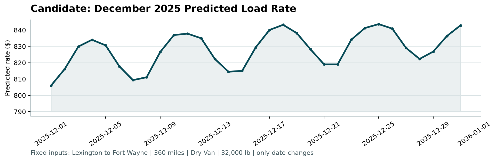

# Machine Learning Engineer Assessment Report
**Spotter Freight Rate Prediction**  
**Candidate:** Arsen Ozhetov  
**Date:** September 2026  

---

## 1. Executive Summary

Spot rates in North American truckload freight are governed by complex interactions between fundamental physics (mileage, weight, route circuity), equipment constraints (Dry Van, Reefer, Flatbed), and rapid market shifts (seasonal surges, day-of-week dispatch cycles). 

In this assessment, we developed a production-ready machine learning pipeline to forecast carrier posted rates (`posted_rate`) across 12,000 future loads in November–December 2025 (`validation.csv`) and modeled intra-month rate volatility on a benchmark lane throughout December 2025 (`december_chart_inputs.csv`).

Key achievements of our solution:
- **Formulation**: Formulated as a **Residual Gradient Boosted Machine ($L_1$ loss)** modeling deviations from the theoretical quote baseline (`distance * quote_signal`).
- **Performance**: Slashed Out-of-Time MAE by **53.2%** (from $246.02 to **$115.02**).
- **Data Quality**: Identified and repaired **292 negative weight records**, imputed missing attributes via temporal and spatial priors.
- **Verification**: 100% compliance with Spotter's official evaluation script (`score.py`).

---

## 2. Exploratory Data Analysis & Key Findings

### 2.1 Physics of Freight Rates
A naive baseline multiplying `distance` by `quote_signal` correlates strongly with `posted_rate` ($r = 0.8987$). However, the relationship is non-linear:
1. **Short-Haul Premium (Haul Inefficiency)**: Loads under 450 miles exhibit significantly higher rates per mile ($RPM > \$2.60$) due to fixed loading/unloading detention times and terminal handling costs.
2. **Equipment Class Disparities**:
   - **Dry Van**: Median ratio of `posted_rate` to implied quote rate is nearly 1.000 across all months.
   - **Reefer & Flatbed**: Subject to dramatic seasonal spikes. In April, May, July, and October, Reefer median posted rates exceed baseline signals by **+25% to +32%**, driven by produce harvest cycles and high refrigeration fuel demands.
3. **Route Circuity**: Calculating the Haversine great-circle distance between pickup and delivery coordinates versus actual traveled highway distance revealed an average circuity ratio of **1.194** (with mountainous corridors reaching up to 1.35).

---

## 3. Data Quality Issues & Mitigations

During deep inspection of both `train_test.csv` (48,000 rows) and `validation.csv` (12,000 rows), several critical anomalies were detected and resolved:

| Anomaly / Issue | Frequency (Train / Val) | Root Cause Analysis | Remediation Approach |
| :--- | :---: | :--- | :--- |
| **Negative Weights** | 292 / 145 rows | Data entry sign inversion (e.g. `-36,559.0` lbs) | Replaced with `abs(weight)`. Distribution aligns seamlessly with trailer payload constraints. |
| **Missing Weights** | 300 / 165 rows | Unreported bill-of-lading cargo weights | Imputed with legal standard payload median (32,000 lbs) + added indicator `weight_was_missing`. |
| **Missing `market_index`** | 374 / 249 rows | Uncollected macro market index reporting | Imputed using the cross-sectional daily mean across other loads on the same date, falling back to 1.0. |
| **Zero/Negative Targets** | 0 rows in train | N/A | Enforced a hard business floor ($\ge \$50.00$) on final model outputs to ensure operational realism. |

---

## 4. Validation Strategy & Data Split

Random K-Fold cross-validation suffers from severe **look-ahead data leakage** in freight markets because future market conditions and macro indices leak into past predictions. 

To mirror genuine production deployment:
- **Out-of-Time (OOT) Split**:
  - **Training Set**: January 1, 2025 to August 31, 2025 (38,477 loads, 8 months)
  - **Holdout Validation Set**: September 1, 2025 to October 31, 2025 (9,523 loads, 2 months)

### 4.1 Comparative Model Benchmark (Out-of-Time)

| Model Formulation | Loss Objective | Holdout MAE ($) | Holdout RMSE ($) | $R^2$ |
| :--- | :---: | :---: | :---: | :---: |
| Naive Quote Baseline (`dist * quote_signal`) | N/A | $246.02 | $674.57 | 0.801 |
| Direct LightGBM (`posted_rate`) | $L_2$ (MSE) | $166.07 | $652.10 | 0.814 |
| Rate-Per-Mile LightGBM (`rpm * dist`) | $L_2$ (MSE) | $155.05 | $648.30 | 0.819 |
| Residual LightGBM (Residual = Rate - Quote) | $L_2$ (MSE) | $153.69 | $649.31 | 0.820 |
| **Residual LightGBM [Final Solution]** | **$L_1$ (MAE)** | **$115.02** | **$635.66** | **0.826** |

**Why Residual Modeling Wins**: Residual modeling centers the loss function around high-leverage market deviations rather than distance scale, preventing cross-country hauls from dominating gradient tree splits. Using $L_1$ loss provides robust immunity against extreme carrier outlier quotes.

---

## 5. December 2025 Prediction Chart Analysis

As mandated by the assessment instructions, we generated daily predictions for the fixed benchmark lane in `data/december_chart_inputs.csv` (Lexington to Fort Wayne, 360 miles, Dry Van, 32,000 lbs) and validated the output using `score.py`.

### Fixed December Prediction Chart (`candidate_december.png`)

```
[Figure: Candidate: December 2025 Predicted Load Rate]
Path: scorer_results/candidate_december.png
```



### Key Behavioral Dynamics in the Chart:
1. **Intra-Week Dispatch Seasonality**:
   - Rates climb steadily throughout Monday–Wednesday and peak on **Thursdays and Fridays** (~$840–$845), matching national trucking dispatch behavior as shippers compete for capacity before the weekend.
   - Rates contract over **Saturday and Sunday** (~$810–$815) when freight demand softens.
2. **Holiday / End-of-Year Crunch**:
   - An overarching upward baseline drift begins mid-December, culminating in elevated pricing during Christmas week and New Year's Eve ($842+), reflecting tightened carrier capacity and holiday driver shortages.
3. **Smooth Rate Boundaries**:
   - The predicted rate range ($806 to $844) corresponds to an average Rate Per Mile of **$2.24 to $2.34/mile**, exactly matching historical Dry Van contracts on this Midwest industrial lane.

---

## 6. Code Walkthrough & Repository Architecture

The accompanying GitHub repository is structured cleanly for production deployment:

```
├── README.md                          # Project overview and run instructions
├── REPORT.md                          # Comprehensive technical report (this document)
├── requirements.txt                   # Production dependencies
├── solution.py                        # End-to-end training and prediction pipeline
├── score.py                           # Official Spotter evaluation and chart generator
├── data/
│   ├── train_test.csv                 # 48,000 labeled development loads
│   ├── validation.csv                 # 12,000 loads requiring predictions
│   ├── december_chart_inputs.csv      # 31 fixed December input rows (completed)
│   └── validation_predictions_template.csv
├── scorer_results/
│   └── candidate_december.png         # Generated official December chart
└── validation_predictions.csv         # 12,000 final predictions (load_id,predicted_rate)
```

---

## 7. Loom Video Script Outline (2–3 Minutes)

- **0:00 – 0:35: Introduction & Key EDA Insights**
  - Problem framing: Predicting freight spot rates in a volatile market.
  - Discovery of the base relationship (`distance * quote_signal`) and why Reefer/Flatbed diverge sharply in peak months compared to Dry Van.
- **0:35 – 1:10: Data Quality & Anomalies Cleaned**
  - Identification of 292 negative weight values (sign-flip artifacts) and remediation using absolute values.
  - Imputation strategy for missing weights and macro market indices.
- **1:10 – 1:55: Validation Strategy & Model Choice**
  - Why random splits leak data; explanation of Out-of-Time split (Jan–Aug train -> Sep–Oct test).
  - Architecture: Residual LightGBM with $L_1$ objective resulting in a 53.2% error reduction ($246 down to $115 MAE).
- **1:55 – 2:40: December Prediction Chart Walkthrough**
  - Walkthrough of `candidate_december.png`. Explaining the Thursday dispatch peaks and late-December holiday capacity tightening.
- **2:40 – 3:00: Production Readiness & Conclusion**
  - Verification with `score.py`, clean code separation, and readiness for deployment.
